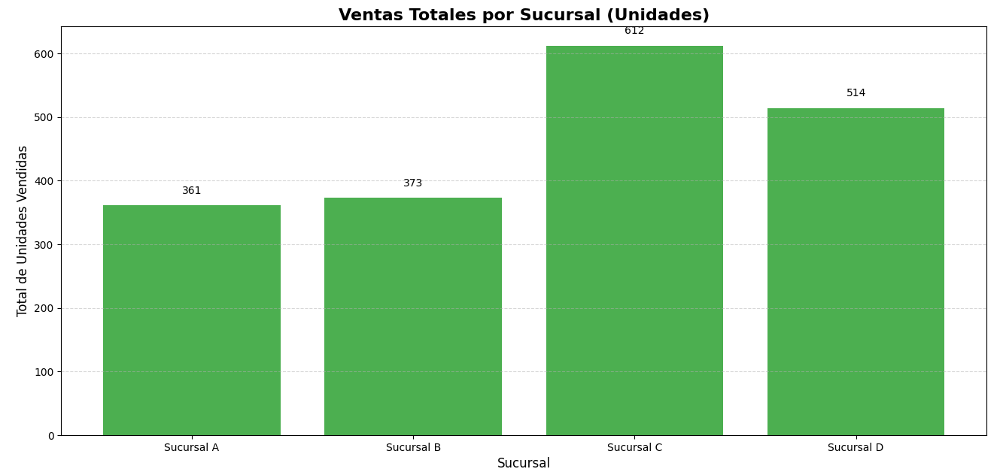
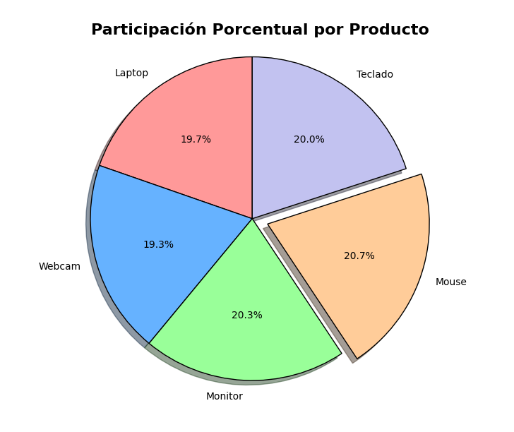

# Proyecto N°11: Análisis Visual de Datos de Ventas

## Visualización de Datos con la Biblioteca Matplotlib

## 1\. Objetivo y Resumen

El objetivo de este proyecto es tomar conjuntos de datos y transformarlos en **representaciones visuales** claras y efectivas. El proyecto se centra en la implementación y personalización de gráficos utilizando la biblioteca **Matplotlib**, el estándar de facto en Python para la creación de gráficos estáticos.

La aplicación genera dos tipos de gráficos comunes en el análisis de ventas:

1.  **Gráfico de Barras:** Para comparar las ventas totales de diferentes sucursales.
2.  **Gráfico Circular (*Pie Chart*):** Para mostrar la distribución porcentual de los productos vendidos.

**Concepto Central:** **Visualización de Datos** para la interpretación y comunicación de métricas de negocio.

-----

## 2\. Tecnologías y Herramientas Utilizadas

Este proyecto se basa en el ecosistema de Data Science de Python.

  * **Lenguaje:** Python 3.x
  * **Librería Principal:** **Matplotlib** (Específicamente el módulo `matplotlib.pyplot` como `plt`).
  * **Módulo de Utilidad:** **`collections.Counter`** (Para calcular rápidamente las frecuencias de los productos en la simulación de datos).
  * **Técnicas Clave:**
      * **Programación Orientada a Funciones:** El código está modularizado con funciones específicas (`generar_grafico_barras`, `generar_grafico_circular`) para cada tipo de gráfico.
      * **Personalización:** Uso de parámetros como `figsize`, `plt.title`, `plt.xlabel`, `plt.ylabel`, y `autopct` para dar un acabado profesional a los gráficos.

-----

## 3\. Resultados Clave

El resultado del proyecto son dos gráficos exportados que permiten una rápida comprensión de las tendencias de ventas.

### Gráfico 1: Ventas por Sucursal (Barras)

  * **Propósito:** Comparación de magnitudes.
  * **Funcionalidad Destacada:** Demuestra el uso de `plt.bar()` y la adición de etiquetas de datos (`plt.text`) directamente sobre cada barra para una lectura precisa.
    

### Gráfico 2: Distribución de Productos (Circular)

  * **Propósito:** Mostrar proporciones de un total.
  * **Funcionalidad Destacada:** Demuestra el uso de la función `autopct='%1.1f%%'` para mostrar los porcentajes dentro de las "rebanadas" y el parámetro `explode` para resaltar el producto más vendido, mejorando el impacto visual.
    

-----

## 4\. Desarrollo del Proyecto (Procedimiento)

El flujo de trabajo se centra en la preparación de datos y el llamado a las funciones de `matplotlib`.

1.  **Simulación de Datos:** En ausencia de un archivo de datos real, se utilizan `random` y `collections.Counter` para generar dos conjuntos de datos que imiten los resultados de un análisis de ventas.
2.  **Función `generar_grafico_barras`:**
      * Llama a `plt.bar()` con las etiquetas de las sucursales y sus valores de ventas.
      * Añade `plt.xlabel` y `plt.ylabel` para asegurar que el gráfico sea autoexplicativo.
3.  **Función `generar_grafico_circular`:**
      * Convierte el `Counter` de productos en listas separadas para etiquetas y tamaños.
      * Calcula el índice del producto más vendido para aplicar el efecto `explode`.
      * Llama a `plt.pie()` utilizando el formato de porcentaje y la personalización de colores/sombras.
4.  **Ejecución:** La función `main()` orquesta las llamadas y finalmente utiliza `plt.show()` para renderizar y mostrar ambos gráficos al usuario.

-----

## 5\. Estructura del Repositorio y Archivos

```
Programacion_con_Python/
└── Proyecto11_Analisis_Visual_Matplotlib/
    ├── analisis_ventas_matplotlib.py  # Implementación de las funciones de graficación.
    ├── assets/
    │   ├── Ventas_Totales_por_Sucursal.png        # Gráfico de barras generado.
    │   └── Participación_Porcentual_por_Producto.png      # Gráfico circular generado.
    └── README.md                     # Documentación del proyecto.
```

-----

## 6\. Conclusiones

Este proyecto demuestra un dominio de:

  * **Visualización de Datos:** Capacidad para seleccionar y generar gráficos adecuados (Barras vs. Circular) según el tipo de pregunta de negocio.
  * **Uso de Matplotlib:** Dominio de las funciones básicas de `pyplot` para la creación y la personalización de gráficos.
  * **Comunicación de Datos:** Habilidad para añadir títulos, etiquetas y *key highlights* (como `explode`) para hacer que los datos sean más accesibles y procesables.
  * **Manipulación de Datos:** Uso de herramientas de utilidad (`Counter`) para preparar los datos para la visualización.

-----
